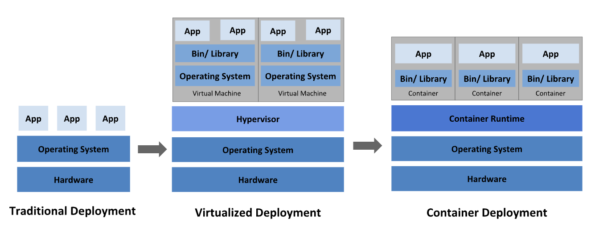
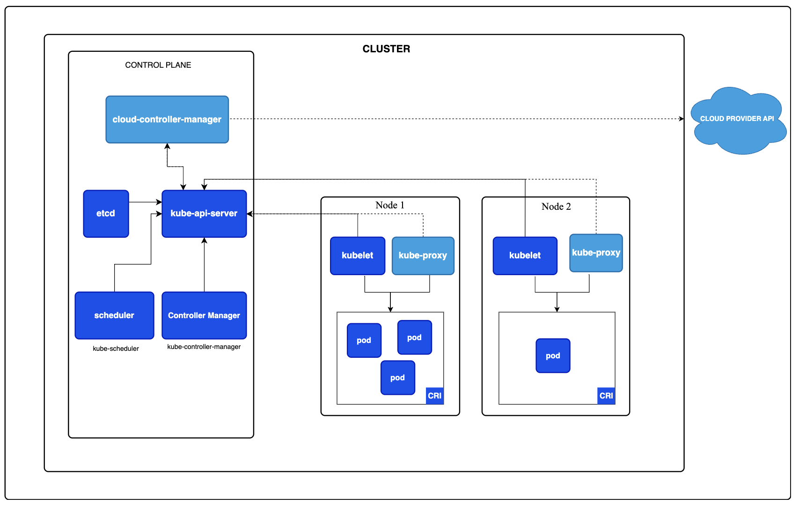

# K8S Architecture 

Kubernetes is a portable, extensible, open source platform for managing containerzed workloads and services, that facilitates both declarative configuration and automation

# Why we need Kubernetes
Containers are a good way to bundle and run your applications.
Kubernetes provides you with a framework to run distributed systems resiliently. It takes care of scaling and failover for your application, provides deployment patterns

* Service discovery and load balancing
* Storage orchestration
* Automated rollouts and rollbacks
* Automatic bin packing
* Self-healing
* Secret and configuration management 
* Batch execution
* Horizontal scaling

# Historical context for Kubernetes

- Traditional deployment : organizations ran applications on physical servers. There was no way to define resource boundaries for applications in a physical server, and this caused resource allocation issues.

- Virtualized deployment : It allows you to run multiple Virtual Machines (VMs) on a single physical server's CPU, Virtualization allows better utilization of resources in a physical server and allows better scalability because an application can be added or updated easily, reduces hardware costs

- Containers are similar to VMs, but they have relaxed isolation properties to share the Operating System (OS) among the applications. Therefore, containers are considered lightweight. Similar to a VM, a container has its own filesystem, share of CPU, memory, process space

Ref - https://kubernetes.io/docs/concepts/overview/#why-you-need-kubernetes-and-what-can-it-do

# Cluster Architecture

A Kubernetes cluster consists of a control plane plus a set of worker machines, called nodes, that run containerized applications. Every cluster needs at least one worker node in order to run Pods.

## Control plane

The control plane's components make global decisions about the cluster, as well as detecting and responding to cluster events 

* kube-apiserver : The API server is a component of the Kubernetes control plane that exposes the Kubernetes API
* etcd : Consistent and highly-available key value store used as Kubernetes' backing store for all cluster data.
* kube-scheduler : Control plane component that watches for newly created Pods with no assigned node, and selects a node for them to run on.
* kube-controller-manager : Control plane component that runs controller processes.
    - Node controller: Responsible for noticing and responding when nodes go down.
    - Job controller: Watches for Job objects that represent one-off tasks, then creates Pods to run those tasks to completion.
    - EndpointSlice controller: Populates EndpointSlice objects (to provide a link between Services and Pods).
    - ServiceAccount controller: Create default ServiceAccounts for new namespaces.

* Cloud-controller-manager : A Kubernetes control plane component that embeds cloud-specific control logic. The cloud controller manager lets you link your cluster into your cloud provider's API,

## Node components

Node components run on every node, maintaining running pods and providing the Kubernetes runtime environment.

- kubelet : An agent that runs on each node in the cluster. It makes sure that containers are running in a Pod.
- kube-proxy : maintains network rules on nodes. These network rules allow network communication to your Pods from network sessions inside or outside of your cluster
- Container runtime : A fundamental component that empowers Kubernetes to run containers effectively. It is responsible for managing the execution and lifecycle of containers within the Kubernetes environment.

