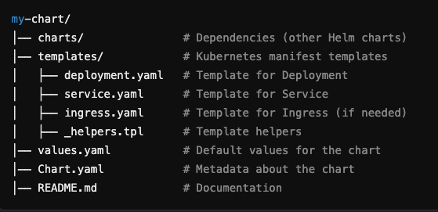

# HELM
A Helm Chart is a package format used to define, install, and upgrade applications in Kubernetes. It simplifies the deployment process by managing configurations, dependencies, and versioning.


## installation 
````
curl https://raw.githubusercontent.com/helm/helm/main/scripts/get-helm-3 | bash
````


## Play ground env 

- https://helm-playground.com/


## Strecture 



## Create helm chart commends 

````
helm create my-chart
helm lint my-chart
````

for Custom values. create file values.yaml 
````
replicaCount: 2

image:
  repository: nginx
  tag: latest
  pullPolicy: IfNotPresent

service:
  type: NodePort
  port: 80

```` 


````
helm get values my-release
helm install my-release my-chart -f values.yaml --dry-run --debug

helm install my-release my-chart -f values.yaml
````

## Install helm chart 

````
helm install my-release my-chart
# check status
helm list
kubetl get pods
````
## Upgrade the existing installed helm chart 

````
helm upgrade my-release my-chart
helm rollback my-release 1
````


## Uninstall the helm chart 

````
helm uninstall my-release
````


##  Using Helm with a Chart Repository


````
helm repo add bitnami https://charts.bitnami.com/bitnami
helm search repo nginx

helm install my-nginx bitnami/nginx

