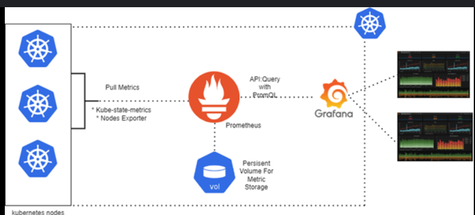

# Monitoring Grafana
Grafana Open Source Software (OSS) enables you to query, visualize, alert on, and explore your metrics, logs, and traces wherever they’re stored.


## Architecture 



## Instalaltion 

````
kubectl apply -f https://github.com/kubernetes-sigs/metrics-server/releases/latest/download/components.yaml

helm repo add grafana https://grafana.github.io/helm-charts
helm repo update

helm install grafana grafana/grafana -n grafana --create-namespace \
  --set adminPassword=Admin@123 \
  --set service.type=NodePort

kubectl port-forward svc/grafana 3000:3000

helm uninstall grafana

````


