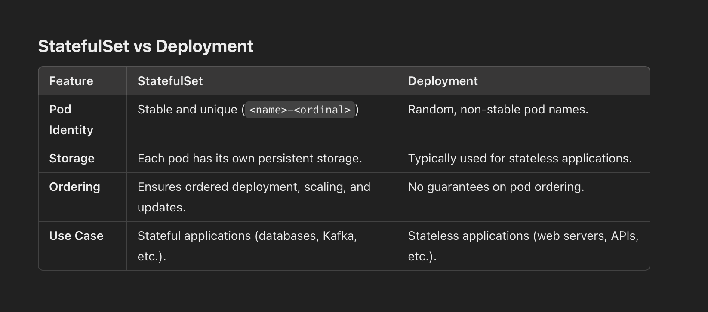

# Statefulsets
StatefulSet is a workload API object designed to manage stateful applications. Unlike a Deployment or ReplicaSet, which manages stateless applications, StatefulSets are used for applications that require persistent storage, stable network identities, or ordered deployment and scaling.

# Key Features of StatefulSet
Stable Network Identity:

- Each pod in a StatefulSet gets a unique, stable DNS name. Even if a pod is deleted and recreated, it retains the same DNS name. The naming convention is <statefulset-name>-<ordinal>. For example, if your StatefulSet is named mysql, the pods will be mysql-0, mysql-1, etc.
Ordered Pod Creation and Deletion:

- Pods are created sequentially (from 0 to N-1) and terminated in reverse order (N-1 to 0). This ordering ensures proper initialization and shutdown of stateful applications.Persistent Storage:

- Each pod in a StatefulSet can have its own persistent storage volume that is not shared with other pods.
These volumes are managed using PersistentVolumeClaims (PVCs), ensuring data is preserved even if the pod is deleted.
Rolling Updates:

- StatefulSets support rolling updates, but the updates are applied in sequence to maintain order and consistency. Scaling:

- Scaling a StatefulSet ensures the new pods maintain the same naming and storage conventions.

# Use Cases for StatefulSet
- Databases (e.g., MySQL, PostgreSQL, MongoDB): Require persistent storage and consistent identities.
- Distributed Systems (e.g., Kafka, Zookeeper, Elasticsearch): Require stable network identities for internal communication.
- Applications with Stateful Workflows: Applications where data needs to persist even after the pod is deleted.

