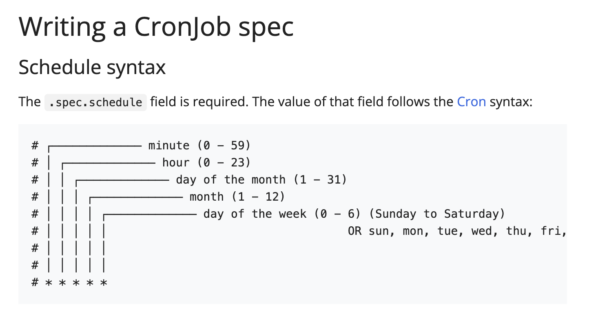

# CronJob

CronJob is meant for performing regular scheduled actions such as backups, report generation, and so on. One CronJob object is like one line of a crontab (cron table) file on a Unix system. It runs a Job periodically on a given schedule, written in Cron format.

