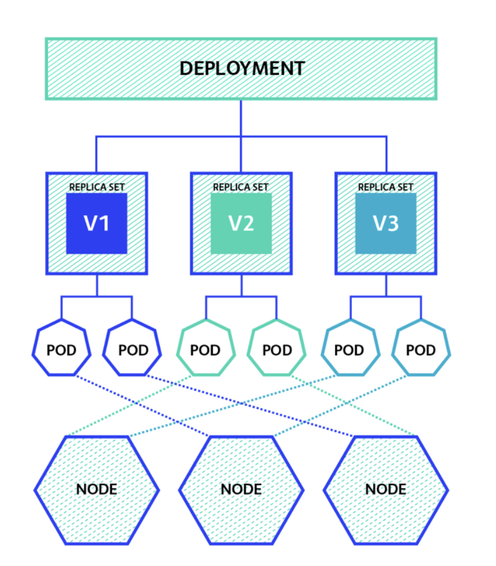
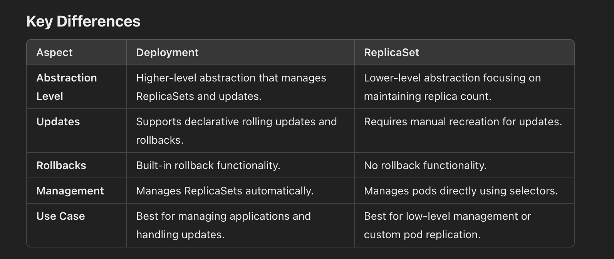

# Deployment 

A Kubernetes Deployment is a higher-level abstraction for managing applications in Kubernetes. It provides declarative updates to applications and ensures that the desired state of the application is maintained over time.




## Key Features of Kubernetes Deployment
- Declarative Updates: You describe the desired state of your application (e.g., number of replicas, container image) in a YAML or JSON file.
- Self-Healing: If a pod crashes or becomes unresponsive, Kubernetes automatically replaces it.
- Scaling: Deployments make it easy to scale applications up or down by changing the replica count.
- Rolling Updates and Rollbacks:
- Perform seamless updates to the application with no downtime.
- Automatically roll back to a previous state if something goes wrong.
- Multi-Version Deployment: Support for blue/green or canary deployments.





# Deployment history 

````
kubectl rollout history deployments/dep-nginx  
kubectl rollout history deployments/dep-nginx --revision=2
kubectl rollout undo deployments/dep-nginx --to-revision=1
````


# Deployment 

## There are two basic commonly used K8s deployment strategies we will look at in this post:

- recreate 
    Recreating deployment terminates all the pods and replaces them with the new version.
- rolling 
    Rolling deployments are the default K8S offering designed to reduce downtime to the cluster. A rolling deployment replaces pods running the old version of the application with the new version without downtime.
    Readiness probes monitor when the application becomes available. If the probes fail, no traffic will be sent to the pod.


Advanced 
- Blue/Green
- Canary
- A/B
- Ramped Slow Rollout
- Best-Effort Controlled Rollout
- Shadow Deployment


## PDB 

A Pod Disruption Budget (PDB) is a Kubernetes policy that ensures a minimum number of replicas of an application remain available during voluntary disruptions (e.g., node upgrades, scaling events).

- Ensures high availability during disruptions.
- Prevents excessive pod evictions due to node drain, rolling updates, etc.
- Helps maintain service reliability.


## how to expose service in minikube 

kubectl expose deployment <deployment-name> --type=NodePort --port=80


minikube service svc-nginx
