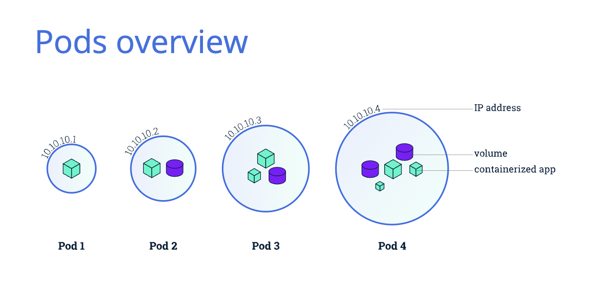

# POD
Pods are the smallest deployable units of computing that you can create and manage in Kubernetes.


A Pod (as in a pod of whales or pea pod) is a group of one or more containers, with shared storage and network resources, and a specification for how to run the containers.


# Command to create pod 

````
kubectl run po --image=nginx --dry-run=client

kubectl apply -f nginx-pod.yaml

kubectl apply -f redis-pod.yaml
````


