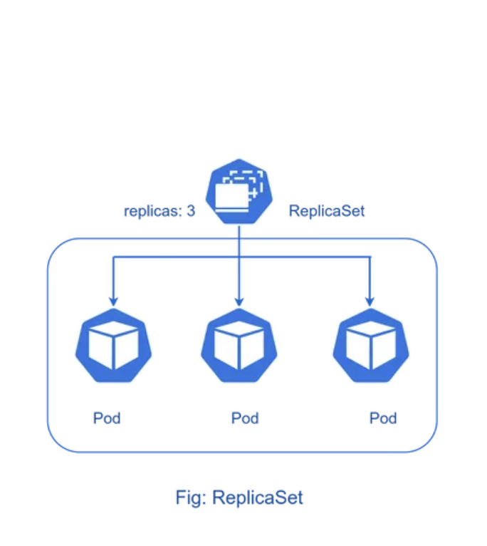

# Replica set 

A ReplicaSet's purpose is to maintain a stable set of replica Pods running at any given time. Usually, you define a Deployment and let that Deployment manage ReplicaSets automatically.

